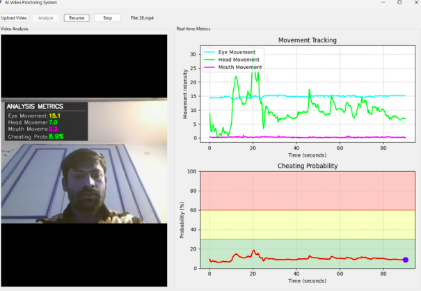

# Pranjal's Portfolio


---


A modern, minimal, and secure portfolio built with Next.js 14, Tailwind CSS, and TypeScript. Showcasing my work in cybersecurity, web development, and technical leadership.

---

## 🚀 Features

- **About**: Learn about my background, tech stack, and philosophy.
- **Projects**: Explore recent projects, including AI Video Proctoring, Sustinlyze360, Linux Audit Script, and more.
- **Experience**: See my professional journey, including internships and leadership roles.
- **Testimonials**: Read kind words from satisfied clients and collaborators.
- **Contact**: Get in touch via email or social media.
- **Responsive & Accessible**: Fully responsive, dark mode, and accessible design.

---

## 🖥️ Tech Stack

- [Next.js 14](https://nextjs.org/)
- [React 18](https://react.dev/)
- [TypeScript](https://www.typescriptlang.org/)
- [Tailwind CSS](https://tailwindcss.com/)
- [Framer Motion](https://www.framer.com/motion/)
- [Three.js](https://threejs.org/) & [@react-three/fiber](https://docs.pmnd.rs/react-three-fiber/getting-started/introduction)
- [GitHub Pages](https://pages.github.com/) (deployment)

---

## 📸 Screenshots

| Home (Hero) | Projects | Experience |
|:---:|:---:|:---:|
|  |  |  |

---

## 🛠️ Getting Started

### Prerequisites
- Node.js 18+

### Development

```bash
# Install dependencies
npm install

# Run development server
npm run dev
```

### Deployment

This portfolio is configured for deployment to GitHub Pages. For detailed setup instructions, see [GITHUB_PAGES_SETUP.md](GITHUB_PAGES_SETUP.md).

```bash
# Build for production
npm run build

# Check deployment status
./check-github-deployment.ps1
```

### Recent Fixes

If you encountered a 404 error on GitHub Pages, the following fixes have been applied:

- Added proper `index.html` files in root and public directories
- Updated build scripts to ensure files are correctly copied
- Added deployment verification script
- Fixed GitHub Actions workflow

For more details, see the [GitHub Pages Setup Guide](GITHUB_PAGES_SETUP.md).
- npm 9+

### Installation

```bash
# Clone the repository
git clone https://github.com/PranjalBugged-Out/my-portfolio.git
cd my-portfolio

# Install dependencies
npm install
```

### Running Locally

```bash
# Start the development server
npm run dev

# Open http://localhost:3000 in your browser
```

### Building for Production

```bash
npm run build
npm start
```

### Deployment

#### GitHub Pages
The portfolio is deployed on GitHub Pages:

1. The site is configured for GitHub Pages in `next.config.mjs` with:
   - `output: 'export'` for static generation
   - `basePath: '/My-Portfolio'` for proper path handling
   - `images: { unoptimized: true }` for GitHub Pages compatibility

2. A GitHub Actions workflow automatically deploys changes to GitHub Pages when pushing to the main branch.

3. The deployed site is available at: [https://pranjalbugged-out.github.io/My-Portfolio/](https://pranjalbugged-out.github.io/My-Portfolio/)

#### Netlify
The portfolio can also be deployed on Netlify:

1. The site is configured for Netlify in `netlify.toml` with:
   - Build command: `npm run build`
   - Publish directory: `out`
   - Netlify Next.js plugin for optimal compatibility

2. To deploy to Netlify:
   ```bash
   # Install Netlify CLI if not already installed
   npm install -g netlify-cli
   
   # Login to Netlify
   netlify login
   
   # Initialize Netlify site (first time only)
   netlify init
   
   # Deploy to Netlify
   netlify deploy --prod
   ```

3. Alternatively, you can connect your GitHub repository to Netlify for automatic deployments.

---

## 🌟 Main Sections

- **About**: My journey, skills, and philosophy.
- **Projects**: 
  - [AI Video Proctoring System](https://github.com/PranjalBugged-Out/video_proctor.git)
  - [Sustinlyze360](https://github.com/PranjalBugged-Out/Sustinlyze360.git)
  - [Linux Audit Script](https://github.com/PranjalBugged-Out/linux-audit-script.git)
  - [ProVital Frontend](https://github.com/PranjalBugged-Out/ProVital-Frontend.git)
- **Experience**: Cybersecurity Intern (IIT Madras), Supervisor (Cybersecurity Club), Technical Project Leadership, Lead Frontend/UI Developer.
- **Testimonials**: Feedback from clients and collaborators.
- **Contact**: [pranjalbabel08@gmail.com](mailto:pranjalbabel08@gmail.com)

---

## 📬 Contact & Socials

- [GitHub](https://github.com/PranjalBugged-Out)
- [LinkedIn](https://www.linkedin.com/in/pranjalbabel/)
- [Twitter/X](https://x.com/paribabel_04?t=uJMqisLDsczk9mtL0-p97g&s=08)
- [Instagram](https://www.instagram.com/paribabel__/)

---

## 📄 License

This project is [MIT](LICENSE) licensed.

---

> Designed & built by Pranjal Babel. Feel free to fork, star, and connect!